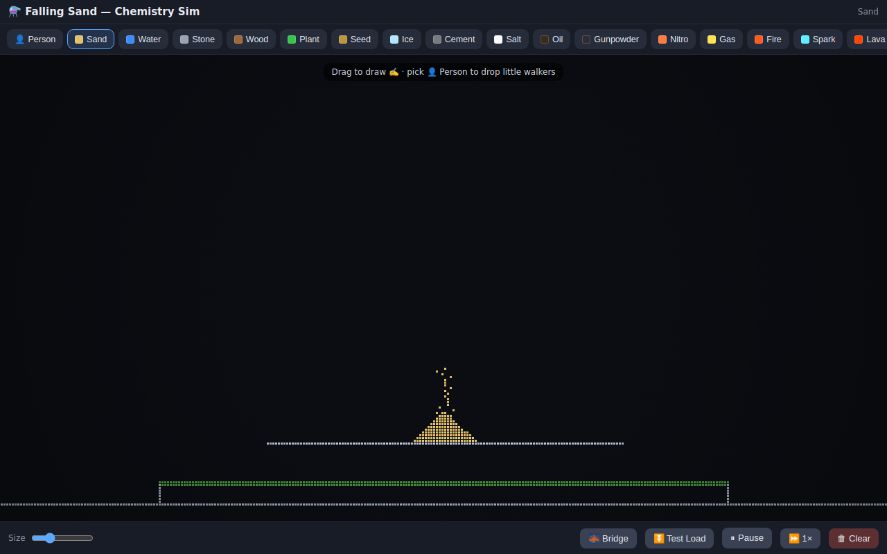

# Falling Sand — Chemistry Sim




A browser falling-sand toy with chemistry reactions, bridge stress tests, and little walkers.

## At a glance

| | |
|---|---|
| **What it is** | A single-file HTML particle sandbox (sand, fluids, fire, nitro, people…). |
| **What it’s for** | Play / prototype material reactions without installing anything. |
| **How to use it** | Open `index.html`, or `./setup.sh` to serve it locally. |

## Try it

### One click
Open [`index.html`](./index.html) in any modern browser.

### One command
```bash
git clone https://github.com/Coinupbtc/falling-sand.git
cd falling-sand && ./setup.sh
# → http://127.0.0.1:8765/
```

### Copy-paste
```bash
python3 -m http.server 8765 --bind 127.0.0.1
# open http://127.0.0.1:8765/
```

## Tips

- Drag to draw; pick **Person** to drop walkers.
- **Bridge** + **Test Load** pours sand weight onto a span — watch it strain.
- Materials include water, oil, lava, gunpowder, nitro, ice, plants, and more.

No build step. No accounts. Just the sim.
